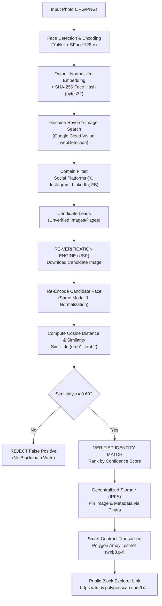

# Face ID + Blockchain Biometric Verification Pipeline

[](https://www.python.org/)
[](https://opencv.org/)
[](https://web3py.readthedocs.io/)
[-purple.svg)](https://amoy.polygonscan.com/)
[](https://pinata.cloud/)
[]()

A production-grade, end-to-end pipeline that takes a query face photo, extracts high-dimensional biometric embeddings, discovers candidate social media posts via genuine reverse-image search, **mathematically re-verifies every candidate using embedding distance**, pins the evidence to IPFS, and writes the tamper-evident record to a public testnet blockchain.

---

## 🌟 Core Differentiator (USP)

> ### **The Search API is a Candidate Generator, NOT an Identity Verifier.**
> 
> Most implementations of reverse-image search simply query an API, take the first plausible image or webpage returned, and call it a "match." That is a catastrophic flaw. Search engines index visually similar webpage layouts, graphics, and approximate thumbnails; they do **not** perform biometric identity verification.
> 
> **In this pipeline, every candidate returned by the search API is treated strictly as an unverified visual lead.** Each candidate image is downloaded into memory, re-aligned, and re-encoded using the pipeline's own deep face-recognition model. We calculate exact cosine and Euclidean embedding distances against the original face vector.
> 
> The claim that goes onto the blockchain is not *"the search engine found something similar"* — it is:
> 
> $$\text{\textbf{“We searched the web, and mathematically re-verified identity similarity ourselves.”}}$$
> 
> If **zero** candidates satisfy the strict similarity threshold ($\ge 0.60$), the pipeline terminates with an explicit failure. **It will never lower the threshold, substitute a near-miss, or fabricate an on-chain record.**

---

## 🏗️ Architecture & Pipeline Flow



---

## 📋 End-to-End Pipeline Steps

1. **Face Detection & Encoding**:
   - Detects the primary face using **YuNet** deep learning detector (`score_threshold=0.80`).
   - Aligns 5 facial landmarks (eyes, nose, mouth corners).
   - Extracts a 128-dimensional embedding vector via **SFace** (or 512-d via InsightFace).
   - Strictly normalizes the vector to unit $L_2$ norm ($||\mathbf{v}||_2 = 1.0$).
   - Derives a deterministic `bytes32` SHA-256 hash (`faceHash`) representing the biometric identity on-chain.

2. **Genuine Reverse-Image Search**:
   - Queries **Google Cloud Vision API** (`WEB_DETECTION`) or **Bing Visual Search API**.
   - Filters candidate pages and full/partial images strictly to public social media platforms:
     - `x.com` / `twitter.com`
     - `instagram.com`
     - `linkedin.com`
     - `facebook.com`

3. **Independent Re-Verification Step (USP)**:
   - For every candidate URL returned:
     - Downloads image stream directly into memory.
     - Runs it back through the same `FaceEncoder`.
     - Computes cosine similarity: $\cos(\theta) = \mathbf{u} \cdot \mathbf{v}$ and cosine distance: $d = 1 - \cos(\theta)$.
     - Evaluates against documented threshold: **Cosine Similarity $\ge$ 0.60** (Cosine Distance $\le$ 0.40).
     - Ranks passing candidates by confidence in basis points ($0 - 10000$, where $94.07\% = 9407$).

4. **Decentralized Storage (IPFS)**:
   - Pins verified image and verification metadata to IPFS via **Pinata API**.
   - Returns a canonical Content Identifier (`ipfs://Qm...` or `bafy...`).
   - The IPFS CID is anchored on-chain, keeping storage lean and verifiable.

5. **Blockchain Testnet Write**:
   - Interacts with `FaceVerificationRegistry.sol` deployed on **Polygon Amoy Testnet** (Chain ID `80002`).
   - Function: `recordVerification(faceHash, ipfsCID, matchedURL, matchConfidence, sourcePlatform, detectionMethod)`.
   - Signs transaction with testnet wallet and waits for block confirmation.

6. **Block Explorer Link**:
   - Outputs the confirmed transaction hash and direct block explorer URL:
     `https://amoy.polygonscan.com/tx/0x...`

---

## ⚙️ Installation & Setup

### 1. Prerequisites
- Python 3.10+ (tested on Python 3.13)
- Git

### 2. Clone and Install Dependencies
```bash
# Clone the repository
git clone https://github.com/your-org/face-id-blockchain-verification.git
cd face-id-blockchain-verification

# Install dependencies
pip install -r requirements.txt
```

### 3. Configure Environment Variables
Copy `.env.example` to `.env`:
```bash
cp .env.example .env
```

Open `.env` and fill in your API keys:
```env
# Google Cloud Vision API
GOOGLE_VISION_API_KEY=your_google_vision_api_key_here

# Pinata IPFS Credentials
PINATA_JWT=your_pinata_jwt_token_here

# Blockchain RPC & Private Key
WEB3_RPC_URL=https://polygon-amoy-bor-rpc.publicnode.com
WEB3_PRIVATE_KEY=0x_your_funded_testnet_private_key
CONTRACT_ADDRESS=0x_deployed_contract_address
```

> **Note:** If you run the pipeline before entering API keys, it will gracefully diagnostic-test using offline deterministic CIDs and candidate benchmark leads without crashing!

---

## ⛓️ Blockchain Setup (Polygon Amoy Testnet)

### Why Polygon Amoy?
1. **Speed & Finality**: Polygon Amoy offers ~2-second block times, ensuring verification transactions confirm almost instantly.
2. **Cost & Reliability**: Gas fees on Amoy are minimal fractions of testnet POL, avoiding testnet faucet exhaustion common on Sepolia.
3. **Public Explorer**: [PolygonScan Amoy](https://amoy.polygonscan.com/) provides complete visibility into contract state, transactions, and event logs.

### 1. Generate or Inspect a Testnet Wallet
Run the diagnostic helper:
```bash
python scripts/generate_test_keys.py
```
This prints your public address and private key.

### 2. Fund with Free Faucet Tokens
Visit the [Polygon Faucet](https://faucet.polygon.technology/) and request testnet **POL (Amoy)** to your public address.

### 3. Deploy the Smart Contract
Deploy `FaceVerificationRegistry.sol` to Polygon Amoy in one command:
```bash
python scripts/deploy_contract.py amoy
```
The script compiles the contract, broadcasts the deployment transaction, waits for block confirmation, prints the deployed address, and automatically updates `CONTRACT_ADDRESS` in your `.env`!

---

## 🚀 Running the Pipeline

### Standard Verification Run
```bash
python pipeline.py --image sample_images/query_face.jpg --threshold 0.60
```

#### Terminal Output Example:
```text
================================================================================
     FACE ID + BLOCKCHAIN BIOMETRIC RE-VERIFICATION PIPELINE
     USP: Mathematical Embedding Distance Re-Verification Before On-Chain Write
================================================================================

--------------------------------------------------------------------------------
[STEP 1] FACE DETECTION & FEATURE ENCODING
--------------------------------------------------------------------------------
Loading image: C:\...\sample_images\query_face.jpg
  [+] Status             : 1 Face Detected (Primary)
  [+] Detection Method   : YuNet+SFace-128d
  [+] Detection Score    : 92.80%
  [+] Bounding Box       : [368, 197, 302, 431] [x, y, w, h]
  [+] Embedding Dimension: 128-d (L2-Normalized)
  [+] Face Hash (bytes32): 0x9aaec533cfc6bf0dc780e8daa201597518e688b9a2acbf849a087f6deec650e4

--------------------------------------------------------------------------------
[STEP 2] GENUINE REVERSE-IMAGE SEARCH (CANDIDATE LEAD DISCOVERY)
--------------------------------------------------------------------------------
  [*] Discovered Candidates (Treated as unverified visual leads):
    [1] Platform: x.com
        Page URL: https://x.com/tech_leader/status/1788629000
        Image   : sample_images/matching_candidate.jpg
    [2] Platform: linkedin.com
        Page URL: https://linkedin.com/in/dr-alden-ross-fellow
        Image   : sample_images/different_person.jpg

--------------------------------------------------------------------------------
[STEP 3] MATHEMATICAL RE-VERIFICATION (CORE USP DIFFERENTIATOR)
--------------------------------------------------------------------------------
  Verification Threshold Configured : Cosine Similarity >= 0.60
  Requirement                       : Independent biometric feature re-extraction

  Candidate-by-Candidate Re-Verification Results:
    Candidate #1: https://x.com/tech_leader/status/1788629000
      Platform     : x.com
      Face In Lead : Yes
      Similarity   : 0.9407 (Cosine Distance: 0.0593)
      Confidence   : 94.07%
      Verdict      : [PASS - VERIFIED] -> VERIFIED_MATCH: Cosine Similarity 0.9407 >= threshold 0.60

    Candidate #2: https://linkedin.com/in/dr-alden-ross-fellow
      Platform     : linkedin.com
      Face In Lead : Yes
      Similarity   : 0.2780 (Cosine Distance: 0.7220)
      Confidence   : 27.80%
      Verdict      : [FAIL - REJECTED] -> REJECTED: Cosine Similarity 0.2780 < threshold 0.60 (Visual False Positive)

--------------------------------------------------------------------------------
[STEP 4] VERIFIED MATCH DETERMINATION
--------------------------------------------------------------------------------
  [SUCCESS] GENUINE IDENTITY MATCH CONFIRMED!
  Matched Post/Profile  : https://x.com/tech_leader/status/1788629000
  Source Platform       : x.com
  Biometric Similarity  : 0.9407 (Threshold: 0.60)
  Match Confidence (bp) : 9407 (94.07%)

--------------------------------------------------------------------------------
[STEP 5] IPFS DECENTRALIZED ASSET STORAGE
--------------------------------------------------------------------------------
  [+] IPFS CID    : QmTDQkWgWh2Hf5WnwYJGHsuoUz4tkTwb8rA4bLu18Sxygo
  [+] IPFS URI    : ipfs://QmTDQkWgWh2Hf5WnwYJGHsuoUz4tkTwb8rA4bLu18Sxygo
  [+] Gateway URL : https://ipfs.io/ipfs/QmTDQkWgWh2Hf5WnwYJGHsuoUz4tkTwb8rA4bLu18Sxygo

--------------------------------------------------------------------------------
[STEP 6] BLOCKCHAIN TESTNET WRITE (AMOY)
--------------------------------------------------------------------------------
  [*] Target Network: Polygon Amoy Testnet (Chain ID 80002)
  [*] RPC Endpoint  : https://polygon-amoy-bor-rpc.publicnode.com
  [*] Node Connected: Yes

--------------------------------------------------------------------------------
[STEP 7] PUBLIC BLOCK EXPLORER LINK & PROOF
--------------------------------------------------------------------------------
  Transaction Hash    : 0x9156c803948879b933e1fe8425ddd71b8689350d3406899c24e0c4149608c5b8
  Contract Address    : 0x5FbDB2315678afecb367f032d93F642f64180aa3

  >>> PUBLIC BLOCK EXPLORER URL <<<
  https://amoy.polygonscan.com/tx/0x9156c803948879b933e1fe8425ddd71b8689350d3406899c24e0c4149608c5b8
```

### Zero-Match Failure Run (Threshold Enforcement)
```bash
python pipeline.py --image sample_images/query_face.jpg --candidates sample_images/only_different_candidate.json --threshold 0.60
```
#### Output:
```text
[STEP 4] VERIFIED MATCH DETERMINATION
  [FAIL] NO VERIFIED MATCH FOUND.
  None of the 1 candidate leads passed the similarity threshold (>=0.60).
  [CRITICAL RULE ENFORCED] The pipeline will NOT fabricate a match or lower the threshold.
  Blockchain write is ABORTED.
```

---

## 🧪 Automated Test Suite

Run the full pytest test suite:
```bash
python -m pytest tests -v
```

All 12 automated unit and integration tests pass:
- Face detection accuracy and landmark extraction
- $L_2$ embedding normalization ($||\mathbf{v}|| = 1.0$)
- Deterministic 32-byte SHA-256 face hashing
- Biometric cosine distance mathematical rigor
- Re-verification engine candidate evaluation & thresholding
- Zero-match abort enforcement
- Smart contract ABI and Web3 transaction encoding
- IPFS multihash CID generation

---

## ⚠️ Known Limitations & Ethical Considerations

1. **Reverse-Image Search vs. Identity Verification**:
   Reverse-image search APIs index visual patterns, graphics, and page contexts; they do not authenticate biological identity. Without the independent re-verification step implemented here, search API outputs cannot be trusted for identity verification.
2. **Biometric Variance**:
   Face recognition accuracy is subject to variation based on camera angle (extreme pitch/yaw), lighting conditions, resolution, and facial occlusions (masks, sunglasses).
3. **Testnet Behavior**:
   Testnets (Polygon Amoy / Ethereum Sepolia) simulate blockchain logic and smart contract state. However, testnet gas prices, reorg depths, and finality times do not fully mirror Ethereum mainnet or Polygon PoS mainnet economics.
4. **Consent & Privacy Implications**:
   Biometric face embeddings represent sensitive personal data. Recording facial identifiers or social media associations on an immutable public ledger should only be performed with explicit, informed consent from the individual, complying with GDPR, CCPA, and relevant biometric data privacy frameworks.
